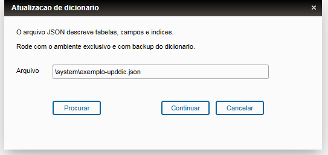
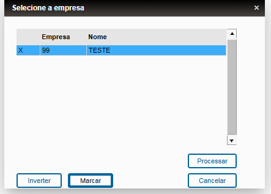
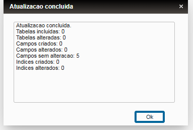
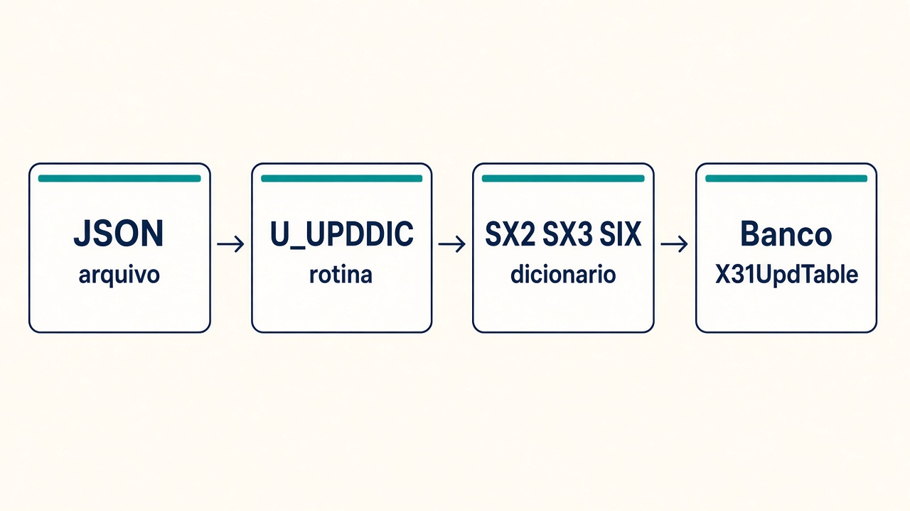
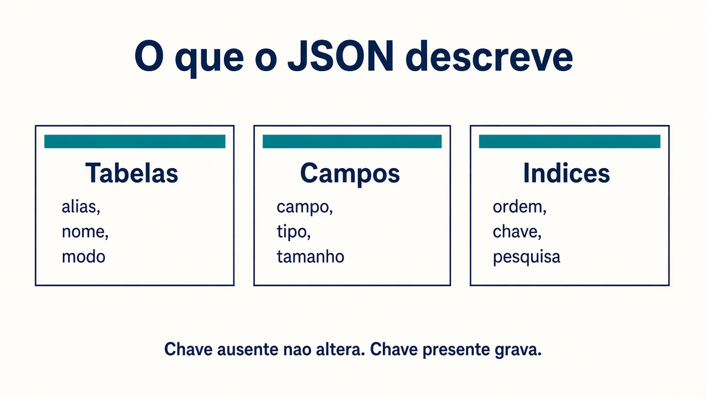
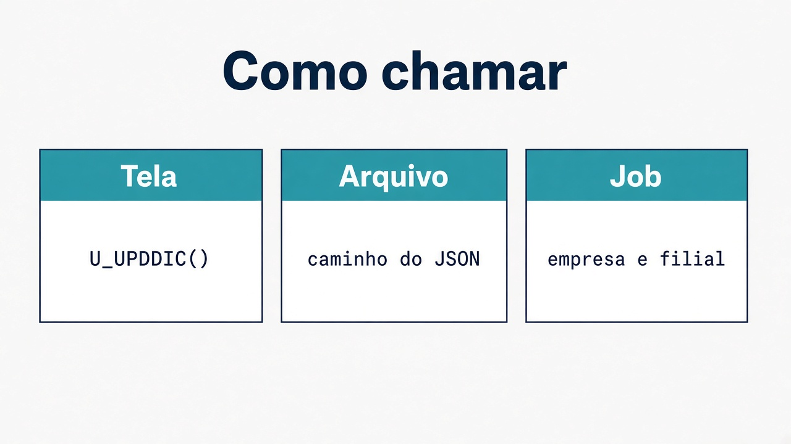

# UPDDIC

Atualiza o dicionário do Protheus (SX2, SX3 e SIX) a partir de um arquivo JSON.

## Telas

O caminho do JSON pode ser absoluto, se estiver dentro do Protheus Data, ou relativo a essa pasta.

Marque a empresa e processe.

Antes de gravar, a rotina mostra o que o JSON descreve (tabelas, campos e índices) e pede confirmação.

No fim, a rotina mostra o que foi incluído, o que mudou e o que já estava igual.

| Arquivo | Conteúdo |
|---|---|
| `src/UPDDICFC.prw` | Fonte. Programa de menu `U_UPDDIC` |
| `MANUAL-UPDDIC.md` | Como chamar, formato do JSON e o que a rotina grava |
| `exemplo-upddic.json` | Modelo de tabela, campos e índices |

Rode com o ambiente exclusivo e com backup do dicionário e da base. O manual descreve a regra de gravação e a atualização física via `X31UpdTable`.

Compile `src/UPDDICFC.prw` no RPO do ambiente. Quem cadastra o menu é o cliente. O programa é `U_UPDDIC`.
